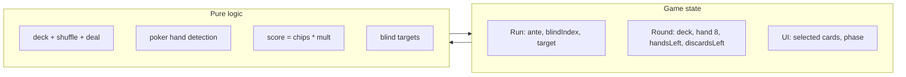

# Balatro Clone – Core Functionality (Generic Red Deck Run)

## Scope

- **In scope:** Deck, deal 8 cards, select 5 to play, poker hand detection, chip + multiplier scoring, discards/redraws, round limits (4 hands, 4 discards), 3-ante blind progression (Small → Big → Boss each ante), win/lose.
- **Out of scope:** Jokers, shop, tags, planet/tarot cards, boss blind effects, styling (minimal UI only). No TypeScript (per [.cursorrules](balatro-one-shot/.cursorrules)); use JavaScript and CSS modules. No Tailwind (existing globals can stay for now; new UI uses CSS modules).

## Core mechanics (reference)

- **Chip values:** 2–10 = face value, J/Q/K = 10, A = 11.
- **Hand scoring:** Score = Chips × Multiplier (chips = sum of the 5 played cards’ chip values; multiplier from hand type).
- **Hand types and base mult:** High Card 5 chips / 1x, Pair 10 / 2x, Two Pair 20 / 2x, Three of a Kind 30 / 3x, Straight 30 / 4x, Flush 35 / 4x, Full House 40 / 4x, Four of a Kind 60 / 7x, Straight Flush 100 / 8x, Royal Flush 100 / 8x.
- **Red Deck:** 4 hands per round, 4 discards per round. No other deck modifiers.
- **Round:** Deal 8 from deck. Player may discard (choose cards to discard, draw same number; uses one discard). When ready, select 5 cards and “Play hand” → one score; if score ≥ blind target, blind is beaten. Each “Play hand” uses one of 4 hands. Round ends when blind is beaten or all 4 hands used (lose run).
- **Blinds:** Each ante has 3 blinds: Small (1× base), Big (1.5×), Boss (2×). Ante 1 Small Blind target = 300; scale base by ante (e.g. base = 300 × ante) so Ante 2 Small = 600, etc. No skip/tag; no boss effects—just target scores.

## Architecture

- **State:** Single source of truth for run (ante, blind index, current target), round (remaining deck, 8-card hand, hands left, discards left), and UI (selected cards, play/discard phase). Prefer one top-level state object + reducer or setState; keep it in React state (no persistence required for MVP).
- **Pure modules:** Deck (create 52, shuffle, draw N), poker (classify 5 cards → hand type + chip sum + multiplier), scoring (chips × mult), blinds (compute target from ante + blind type). No UI in these.
- **Components:** One main game page that reads state and dispatches actions (deal, discard, play hand, next blind). Child components for hand display, card selection, and simple buttons (Play hand, Discard, etc.). Minimal layout; focus on correct behavior.

## File structure

- `**lib/deck.js`** – createDeck(), shuffle(deck), draw(deck, n). Card shape: `{ suit, rank }` (rank 2–14 or '2'–'A' as needed for poker).
- `**lib/poker.js`** – detectHand(fiveCards) → { handType, chipValue, multiplier } (chipValue = sum of 5 cards; multiplier from table above). Helpers for straight/flush detection, rank comparisons.
- `**lib/scoring.js`** – scoreHand(fiveCards) = chips × mult; getBlindTarget(ante, blindType) for Small/Big/Boss.
- `**lib/blinds.js**` – List of blinds per ante (e.g. [{ type: 'small', mult: 1 }, { type: 'big', mult: 1.5 }, { type: 'boss', mult: 2 }]); base target 300 × ante. Function to get current blind and next.
- `**lib/gameState.js**` – Initial state factory and action handlers (startRun, startRound, discard, playHand, nextBlind). Handlers are pure: (state, action) => newState.
- `**app/page.jsx**` – Main game UI: show 8 cards (selectable), “Play hand” (when 5 selected) and “Discard” (when 1–5 selected), display last score + current target, hands/discards left, ante/blind name. Wire state from useState/useReducer to gameState.
- `**app/page.module.css**` – Minimal layout (grid/flex for cards and buttons). No Tailwind in new code; use classes for card area, buttons, and status text.
- `**app/layout.jsx**` – Convert from existing [app/layout.tsx](balatro-one-shot/app/layout.tsx) to JS and ensure it renders children; keep or simplify [app/globals.css](balatro-one-shot/app/globals.css) as needed.

## Implementation order

1. **Deck and cards** – Implement `lib/deck.js` with createDeck, shuffle, draw; define rank order and chip value per rank (used by poker).
2. **Poker and scoring** – Implement `lib/poker.js` (classify 5 cards, return hand type + chip sum + multiplier) and `lib/scoring.js` (score = chips × mult). Add `lib/blinds.js` (targets for 3 antes × 3 blinds).
3. **Game state** – Implement `lib/gameState.js`: initial run/round state, actions for startRun, startRound, discard (replace selected cards from deck, decrement discards), playHand (compute score, compare to target, decrement hands; if win → nextBlind or nextAnte), and transition to next round when blind beaten.
4. **UI** – Replace [app/page.tsx](balatro-one-shot/app/page.tsx) with `app/page.jsx`: render 8 cards (click to select up to 5), “Play hand” / “Discard”, show target, score, hands/discards left, ante/blind. Wire to gameState so each action updates state and re-renders. Add `app/page.module.css` for layout.
5. **Layout** – Convert `app/layout.tsx` to `app/layout.jsx` (remove type annotations; keep font/body structure). Delete or rename old `page.tsx` to avoid conflicts.

## Edge cases

- **Playing a hand:** Exactly 5 cards must be selected; Play hand uses one “hand” and then either wins the blind (advance) or leaves the same blind and same 8 cards (player can discard or play again).
- **After beating a blind:** If Boss beaten, advance to next ante and reset to Small Blind; if Small/Big beaten, advance to Big/Boss. Then start new round: new deal (8 from remaining deck; if deck has < 8, shuffle discard pile and use as new deck).
- **Deck exhaustion:** When drawing, if deck has fewer cards than needed, shuffle the “discard pile” (all previously played/discarded cards) and add to deck, then draw. So we need a “discard pile” in state (cards that left the hand) and merge + shuffle when deck is empty.
- **Lose condition:** When hands left reaches 0 and the blind was not beaten in that round → game over.

## Testing

- Unit-test poker detection with known hands (e.g. 5 cards for a flush, straight, full house) and that score = chips × multiplier.
- Manually test: play one full run through 3 antes (9 blinds), confirm targets and win/lose and that deck refill works when deck runs low.

## Summary

Deliver a minimal playable loop: deal 8, discard/draw, play 5-card hands, score vs target, 4 hands and 4 discards per round, 3 antes with Small/Big/Boss each, no jokers/shop. All game logic in pure `lib/*.js`; UI in `app/page.jsx` + CSS module; layout converted to JS.